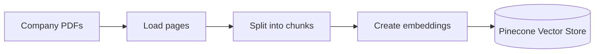
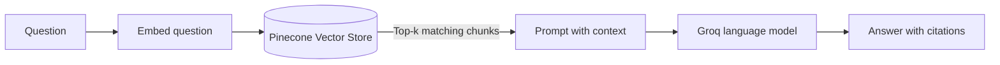

# How the project works

There are two flows: prepare the PDFs once, then search the saved vectors each time someone asks a question.

## Ingestion: prepare the PDFs once

Text version: PDFs → load pages → chunk text → create embeddings → save vectors in Pinecone.

## Query time: repeat for every question

Text version: question → embed the question → search the Vector Store → return the top-k chunks → send prompt and context to the LLM → answer with citations.

The arrow from the Vector Store carries the retrieved chunks. At query time, the app searches the stored vectors; it does not search the original PDFs directly.

## Which file handles each stage?

| File | Stage | What it produces |
|---|---|---|
| `step1_load.py` | Load | Page-level LangChain documents. In this checkout, it currently looks in the wrong folder and exits with an error. |
| `step2_chunk.py` | Chunk | 16 overlapping text chunks from the PDFs in `data/`. |
| `step3_embed_store.py` | Embed and store | A Pinecone index named `rag-index` with the chunk vectors. |
| `step4_retrieve.py` | Retrieve | Up to three similar chunks for a fixed question. |
| `step5_rag_answer.py` | RAG answer | A generated answer and a printed source list. |
| `app.py` | Web app | A Streamlit chat interface that uses the same retrieval and answer flow. |
| `data/*.pdf` | Source material | Three sample company PDFs, six pages in total. |

[Next: Project setup](03-setup.md)
